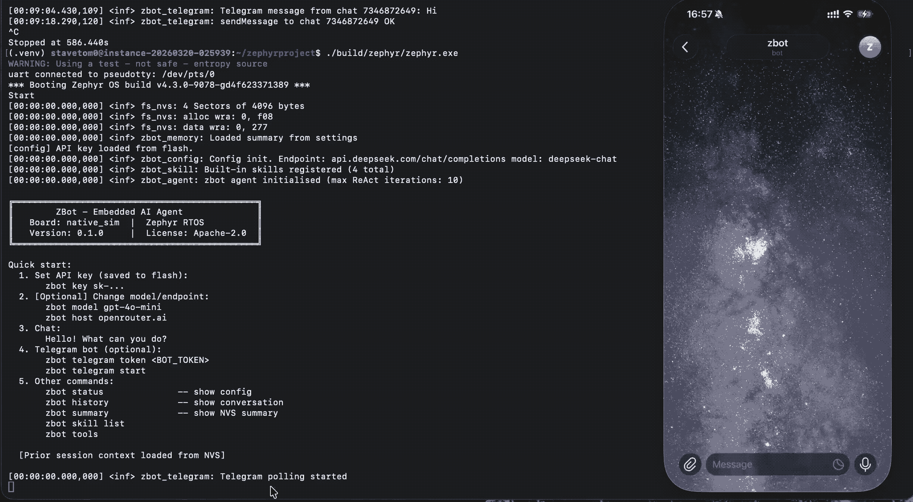
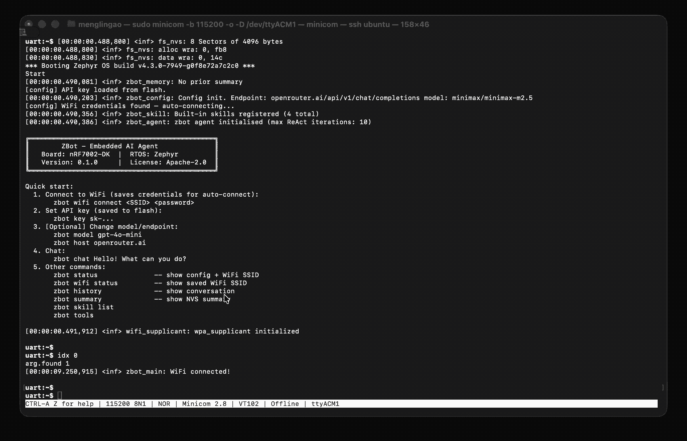

# ZBot

An open-source embedded AI agent powered by **Zephyr RTOS**. ZBot implements a ReAct (Reason + Act) loop that connects to any OpenAI-compatible LLM API and can control hardware, maintain conversation memory across reboots, and run multi-step skills.




**Supported boards:** nRF7002-DK (nRF5340 + nRF7002 WiFi), native_sim (Linux host)
**RTOS:** [Zephyr](https://zephyrproject.org) ≥ latest
**License:** Apache-2.0

---

## Architecture

```
┌──────────────────────────────────────────────────────┐
│                    ZBot Agent                        │
│                                                      │
│  ┌──────────┐  ┌──────────┐  ┌──────────────────┐    │
│  │  Config  │  │  Memory  │  │   LLM Client     │    │
│  │ endpoint │  │ K_FIFO   │  │  HTTP → OpenAI   │    │
│  │ model    │  │ pool+    │  │  compatible API  │    │
│  │ api key  │  │ settings │  │                  │    │
│  └──────────┘  └──────────┘  └──────────────────┘    │
│                                                      │
│  ┌──────────┐  ┌──────────┐  ┌──────────────────┐    │
│  │  Tools   │  │  Skills  │  │  Agent (ReAct)   │    │
│  │ gpio_read│  │ blink    │  │  Reason→Act loop │    │
│  │ gpio_writ│  │ sos      │  │  tool calling    │    │
│  │ get_heap │  │ status   │  │  auto-summarise  │    │
│  │ board_inf│  │ clear_mem│  │                  │    │
│  └──────────┘  └──────────┘  └──────────────────┘    │
│                                                      │
│  ┌────────────────────────────────────────────────┐  │
│  │  Shell Commands  (zbot key / chat / skill ...) |  │
│  └────────────────────────────────────────────────┘  │
│                                                      │
│  ┌──────────┐                                        │
│  │ Telegram │  Long-poll thread → agent → sendMessage│
│  │   Bot    │                                        │
│  └──────────┘                                        │
└──────────────────────────────────────────────────────┘
```

### Modules

| Module | File | Purpose |
|--------|------|---------|
| **Config** | `config.h/c` | LLM endpoint, model, API key + WiFi credentials (settings persistence) |
| **Memory** | `memory.h/c` | k_mem_slab conversation history + settings-persisted rolling summary |
| **LLM Client** | `llm_client.h/c` | HTTPS POST to OpenAI-compatible Chat Completions API |
| **Tools** | `tools.h/c` | Atomic hardware actions: GPIO, uptime, heap, board info |
| **Skills** | `skill.h/c` | Multi-step reusable workflows (blink, SOS, status, clear) |
| **Agent** | `agent.h/c` | ReAct loop: reason → call tool → observe → repeat → summarise |
| **Telegram** | `telegram.h/c` | Telegram Bot long-poll thread; forwards messages to agent and replies |
| **JSON Util** | `json_util.h/c` | Shared JSON string extraction (`json_get_str`) and escaping (`json_escape`) |
| **Shell** | `shell_cmd.c` | All `zbot` shell subcommands |

### ReAct Loop

```
user input
    │
    ▼
build messages JSON  ←────────────────────────────────────────────────┐
    │                                                                 │
    ▼                                                                 │
LLM API call (tools enabled)                                          │
    │                                                                 |
    ├── finish_reason: tool_call ──► execute tool ──► append result ──┘
    │
    └── finish_reason: stop ──► return answer to user
                                        │
                                        ▼
                                request summary ──► NVS
```

Max iterations per turn: **10**

### Conversation Memory

History uses a **10-node static pool** (`k_mem_slab`) backed by a `sys_slist_t` linked list ordered oldest → newest.

When `k_mem_slab_alloc` fails on `memory_add_turn()`:
1. **Compress** — the oldest nodes are summarised by the LLM; the source nodes are freed back to the slab.
2. **Evict** *(fallback if compression fails)* — the oldest history node is recycled directly.

After each compression, the rolling summary is written to NVS and injected as prior context on the next boot.

**Settings layout:**

| Settings key | Type | Notes |
|---|---|---|
| `zbot/summary` | `char[768]` | Conversation summary (managed by memory.c) |
| `zbot/apikey` | `char[256]` | Saved automatically when `zbot key` is run |
| `zbot/host` | `char[128]` | LLM endpoint hostname |
| `zbot/path` | `char[128]` | LLM API path |
| `zbot/model` | `char[128]` | Model name |
| `zbot/provider_id` | `char[64]` | `X-Model-Provider-Id` header value |
| `zbot/use_tls` | `uint8_t` | TLS enabled flag |
| `zbot/tls_verify` | `uint8_t` | TLS peer certificate verification flag (default: on) |
| `zbot/port` | `uint16_t` | TCP port |
| `zbot/tg_token` | `char[128]` | Telegram Bot API token |
| `wifi/...` | — | WiFi credentials managed by Zephyr `wifi_credentials` subsystem |

All configuration fields are persisted to NVS automatically when set.
WiFi credentials are stored by `CONFIG_WIFI_CREDENTIALS` (separate from the `zbot` subtree).

---

## Prerequisites

Set up a Zephyr development environment following the official guide:
https://docs.zephyrproject.org/latest/develop/getting_started/index.html

The latest Zephyr version is recommended. Once your environment is ready, clone zbot into your workspace and proceed below.

---

## Quick Start

### 1. Build & Flash

**nRF7002-DK** (physical hardware with WiFi):

```bash
west build -b nrf7002dk/nrf5340/cpuapp zbot
west flash
```

**native_sim** (Linux host simulation, no WiFi):

```bash
west build -b native_sim zbot
./build/zephyr/zephyr.exe
```

### 2. Connect Serial

For nRF7002-DK:

```bash
minicom -D /dev/ttyACM0 -b 115200
# or
screen /dev/ttyACM0 115200
```

For native_sim, the shell is on the terminal where you launched `zephyr.exe`.

### 3. Connect to WiFi (nRF7002-DK only)

```
uart:~$ zbot wifi connect <SSID> <password>
```

Credentials are saved to flash. On the next reboot, the board auto-connects without any manual command.

> **native_sim:** No WiFi configuration needed — the host OS provides the network stack.

### 4. Set API Key

> **Default Provider (OpenRouter)**
> You need a OpenRouter API key to use this example.  
> OpenRouter provides a limited number of free requests per day.
> Get it from: https://openrouter.ai/settings/keys

```
uart:~$ zbot key sk-...
```

The key is saved to NVS flash immediately and restored on every reboot.

### 5. (Optional) Configure Endpoint

> **For OpenAI**
> You need a OpenAI API key to use this example.  
> Get it from: https://platform.openai.com/api-keys

```
uart:~$ zbot tls_verify off
uart:~$ zbot host api.openai.com
uart:~$ zbot path /v1/chat/completions
uart:~$ zbot model gpt-5.2
uart:~$ zbot key sk-...
```

> **For DeepSeek**
> You need a DeepSeek API key to use this example.  
> Get it from: https://platform.deepseek.com/api_keys

```
uart:~$ zbot tls_verify off
uart:~$ zbot host api.deepseek.com
uart:~$ zbot path /chat/completions
uart:~$ zbot model deepseek-chat
uart:~$ zbot key sk-...
```

> **For Xiaomi MIMO**
> You need a Xiaomi MIMO API key to use this example.  
> Get it from: https://platform.xiaomimimo.com/#/console/api-keys

```
uart:~$ zbot tls_verify off
uart:~$ zbot host api.xiaomimimo.com
uart:~$ zbot path /v1/chat/completions
uart:~$ zbot model mimo-v2-pro
uart:~$ zbot key sk-...
```

> **For BigModel**
> You need a BigModel API key to use this example.
> Get it from: https://bigmodel.cn/usercenter/proj-mgmt/apikeys

```
uart:~$ zbot tls_verify off
uart:~$ zbot host open.bigmodel.cn
uart:~$ zbot path /api/paas/v4/chat/completions
uart:~$ zbot model glm-5
uart:~$ zbot key sk-...
```

> **For a local model (e.g. Ollama)**

```
uart:~$ zbot host 192.168.1.100
uart:~$ zbot tls off 11434
```

### 6. (Optional) Configure Telegram Bot

> Create a bot via [@BotFather](https://t.me/BotFather) on Telegram to obtain a token.

```
uart:~$ zbot telegram token 1234567890:AAxxxxxxxxxxxxxxxxxxxxxxxxxxxxxxxxxx
uart:~$ zbot telegram start
```

The token is saved to NVS flash. On the next reboot, polling starts automatically if a token is stored.

Send any message to the bot and it will be forwarded to the ZBot agent; the reply is sent back to your Telegram chat.

### 7. Chat

```
uart:~$ zbot chat
Entering interactive chat mode. Type /exit to quit.
zbot:~$ Hello! What can you do?
Thinking...

zbot: Hi! I'm zbot ...

zbot:~$ Turn on LED0
Thinking...

zbot: Done — LED0 is now on.

zbot:~$ /exit
Leaving chat mode.
uart:~$
```

---

## Shell Commands

All commands are subcommands of `zbot`.

### Configuration

| Command | Description |
|---------|-------------|
| `zbot key <key>` | Set API key (saved to flash automatically) |
| `zbot key-delete` | Delete API key from flash |
| `zbot config_reset` | Reset all config to defaults and wipe from flash |
| `zbot host <hostname>` | Set LLM endpoint host (saved to flash) |
| `zbot path <path>` | Set LLM API path (saved to flash) |
| `zbot model <name>` | Set model name (saved to flash) |
| `zbot provider <id>` | Set `X-Model-Provider-Id` header (saved to flash) |
| `zbot tls <on\|off> [port]` | Enable/disable TLS and set port (saved to flash) |
| `zbot tls_verify <on\|off>` | Enable/disable TLS peer certificate verification (saved to flash) |
| `zbot status` | Show current config and agent state |

### WiFi (nRF7002-DK only)

> These commands are only available when `CONFIG_WIFI=y` (e.g. nRF7002-DK). They are omitted on boards without WiFi (e.g. `native_sim`).

| Command | Description |
|---------|-------------|
| `zbot wifi connect <ssid> [pass]` | Connect to WiFi and save credentials to flash |
| `zbot wifi disconnect` | Disconnect from current WiFi network |
| `zbot wifi status` | Show saved SSID |

### Conversation

| Command | Description |
|---------|-------------|
| `zbot chat` | Enter interactive chat mode (`zbot:~$ ` prompt; `/exit` to quit) |
| `zbot history` | Print in-RAM conversation history |
| `zbot summary` | Show the NVS-persisted session summary |
| `zbot clear` | Clear RAM history (keeps NVS summary) |
| `zbot wipe` | Wipe all history and NVS summary |

### Telegram Bot

| Command | Description |
|---------|-------------|
| `zbot telegram token <token>` | Set Telegram Bot API token (saved to flash) |
| `zbot telegram start` | Start long-poll thread |
| `zbot telegram stop` | Stop long-poll thread |
| `zbot telegram status` | Show token and polling state |

### Skills & Tools

| Command | Description |
|---------|-------------|
| `zbot skill list` | List all registered skills |
| `zbot skill run <name> [arg]` | Run a skill directly |
| `zbot tools` | List all available tools with descriptions |

---

## Built-in Tools

Tools are invoked automatically by the agent during the ReAct loop.

| Tool | Parameters | Description |
|------|-----------|-------------|
| `gpio_read` | `pin`: `led0` / `led1` / `button0` | Read GPIO pin level |
| `gpio_write` | `pin`: `led0` / `led1`, `value`: `0` / `1` | Set GPIO output level |
| `get_uptime` | — | Device uptime in ms and seconds |
| `get_board_info` | — | Board model, SoC, WiFi chip, RTOS, version |
| `get_heap_info` | — | Heap free / allocated / max-used bytes |
| `echo` | `message`: string | Echo a message (for testing) |

---

## Built-in Skills

Skills are multi-step workflows invocable by name.

| Skill | Argument | Description |
|-------|----------|-------------|
| `blink_led` | Count (1–20, default 3) | Blink LED0 N times at 300 ms intervals |
| `sos` | — | Blink SOS morse code pattern on LED0 |
| `system_status` | — | Report uptime, heap usage, and board info |
| `clear_memory` | — | Wipe conversation history and NVS summary |

```
uart:~$ zbot skill run blink_led 5
uart:~$ zbot skill run sos
uart:~$ zbot skill run system_status
```

---

## Extending zbot

### Adding a Custom Tool

Add a handler and entry to `g_tools[]` in `tools.c`:

```c
int tool_my_sensor(const char *args_json, char *result, size_t res_len)
{
    snprintf(result, res_len, "{\"temp_c\":25}");
    return 0;
}

// in g_tools[]:
{
    .name = "read_temperature",
    .description = "Read the ambient temperature sensor.",
    .parameters_json_schema = "{\"type\":\"object\",\"properties\":{}}",
    .handler = tool_my_sensor,
},
```

The agent will include the new tool in every LLM request automatically.

### Adding a Custom Skill

```c
static int my_skill(const char *arg, char *result, size_t res_len)
{
    snprintf(result, res_len, "done");
    return 0;
}

// in main.c or skill.c, before agent_init():
skill_register("my_skill", "Description of what it does", my_skill);
```

---

## Security Notes

- **API key** is saved to NVS flash immediately when set via `zbot key`. Use `zbot key-delete` to remove it. Anyone with physical flash access can read the raw NVS partition.
- **Telegram token** is saved to NVS flash when set via `zbot telegram token`. Use `zbot config_reset` to wipe it.
- **WiFi passphrase** is stored in flash as plain text when you use `zbot wifi connect`. Anyone with physical flash access can read it. Acceptable for dev boards; use additional protections in production.
- **TLS peer verification** is enabled by default (`tls_verify on`). Disable it with `zbot tls_verify off` only for development/debugging against servers with self-signed certificates. Note: the Telegram module always skips peer verification to avoid bundling a CA certificate.
- **NVS summary** is stored as plain text. Avoid sensitive information in conversations if flash readout is a concern.

---

## Project Structure

```
zbot/
├── CMakeLists.txt
├── prj.conf                              # Zephyr Kconfig (shared, all boards)
├── sysbuild.conf                         # Sysbuild stub (board-specific overrides below)
├── boards/
│   ├── nrf7002dk_nrf5340_cpuapp.conf     # nRF7002-DK: WiFi, credentials, entropy
│   └── native_sim.conf                   # native_sim: offloaded sockets, POSIX/libc
├── sysbuild/
│   └── nrf7002dk_nrf5340_cpuapp.conf     # nRF7002-DK: SB_CONFIG_WIFI_NRF70=y
└── src/
    ├── main.c          # Boot sequence; WiFi events guarded by #if defined(CONFIG_WIFI)
    ├── config.h/c      # LLM runtime config + settings persistence;
    │                   #   WiFi helpers guarded by #if defined(CONFIG_WIFI)
    ├── memory.h/c      # K_FIFO history pool + settings summary
    ├── llm_client.h/c  # HTTPS Chat Completions client
    ├── tools.h/c       # Hardware tool primitives (board-generic via DT_ALIAS)
    ├── skill.h/c       # Multi-step skill framework
    ├── agent.h/c       # ReAct reasoning loop + system prompt (uses CONFIG_BOARD)
    ├── telegram.h/c    # Telegram Bot long-poll thread + sendMessage
    ├── json_util.h/c   # Shared json_get_str() / json_escape()
    └── shell_cmd.c     # `zbot` shell command tree;
                        #   `zbot wifi` subcommands guarded by #if defined(CONFIG_WIFI)
```

## ⭐ Star History

⭐ If you like this project, give it a star!

[](https://star-history.com/#LingaoM/zbot&Date)
